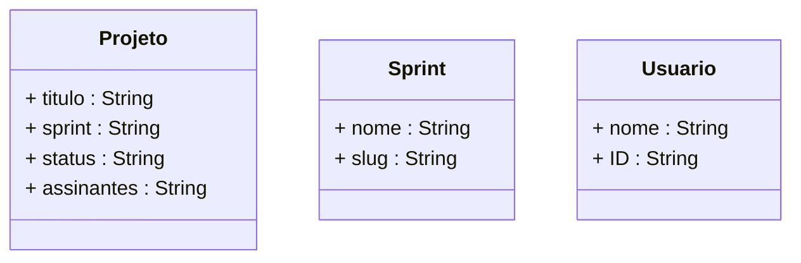

# 🤖 OCCINHO - Bot do discord do OCCA Social Club
O **OCCINHO** é um bot desenvolvido com o objetivo de acessar a API de EVA e obter informações sobre sprints, tarefas e comparar as informações com as armanezadas localmente.

## 🤔 Como funciona?

O **OCCINHO** funciona utilizando o [discord](https://discord.com) como interface para receber comandos e exibir as informações.

### Lista de commandos
- `ranking` Este comando atualiza os projetos e gera um ranking de usuários com base nos pontos acumulados.

    ```
    /ranking
    ```

- `pontos-por-sprint` Este comando mostra os pontos EVA e XP de cada usuário por sprint.

    ```
    /pontos-por-sprint
    ```

- `atualizar` Este comando verifica se há novos projetos ou atualizações em projetos existentes e os sincroniza com a base de dados Parse Server.


    ```
    /pontos-por-sprint
    ```
    
### Cálculos Específicos
- Pontos EVA e XP

  > Os pontos EVA são calculados com base em um padrão encontrado nos títulos dos projetos, como "[G: 32 x 2.5]", onde o tipo (G, I, N) define o multiplicador de pontos.
Os XP são calculados com base na média dos pontos EVA das sprints. Se a média for maior ou igual a 16, cada ponto EVA equivale a 30 XP. Caso contrário, utiliza uma fórmula ajustada para calcular os XP com base na diferença em relação a 16.

## 👩‍💻👨‍💻 Requisitos

### Tecnologias
- `node.js`

### Instalação
1)  Clone do repositório
  
```bash
git clone https://github.com/OLINDA-CREATIVE-COMMUNITY-ACTION-OCCA/bot-occa-social-club.git
```
2)  Mover o Diretório
```bash
cd bot-occa-social-club-main\src
```
3) Dependências
```bash
npm install axios
```
```bash
npm install discord.js
```
```bash
npm install dotenv
```
```bash
npm install parse
```
### Execução
```bash
node index.js
```

### Classes Mapeadas na API


## Participantes
- David Pontes
  - [GitHub](https://github.com/Davidbjjj)
  - [LinkedIn](https://www.linkedin.com/in/pondavid/)
- Otoniel Júnior
  - [GitHub](https://github.com/otonielnn)
  - [LinkedIn](https://www.linkedin.com/in/otonielnn/)
- Vandilma Candido
  - [GitHub](https://github.com/Vandilmacandido)
  - [LinkedIn](https://www.linkedin.com/in/vandilma-candido/)
- Victor Yghor
  - [GitHub](https://github.com/Davidbjjj)
  - [LinkedIn](https://www.linkedin.com/in/victor-yghor/)
- Vitórya Medeiros
  - [GitHub](https://github.com/vitoryamedeiros)
  - [LinkedIn](https://www.linkedin.com/in/vitoryamedeiros/)